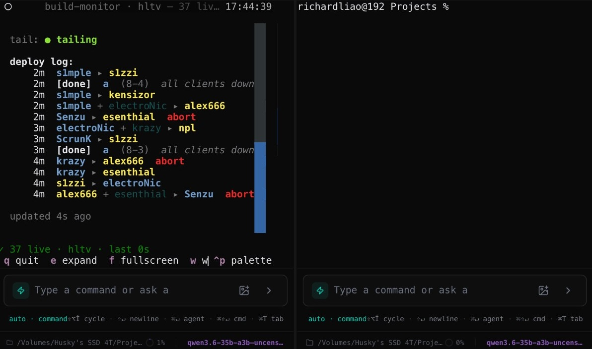

# csmatch

> Live CS2 pro matches in your terminal. No browser, no ads, no API key.


## What it solves

- **Watch matches without a browser.** Series score, current map, round timer, per-player K/A/D/HP/$/ADR — every second, in plain text.
- **Real per-kill feed.** With weapon, headshot, assist, and bomb plant/defuse. The same data HLTV streams to its match center page.
- **What's on next.** Upcoming today, with countdowns.
- **Alternate "monitor" theme** (toggleable). The same data, in a build/SRE-monitor vocabulary — see below.

## Install

```sh
uv sync
uv run playwright install chromium    # only for HLTV live scorebot
```

## Run

```sh
uv run csmatch                  # default (bo3.gg, broad coverage)
uv run csmatch --source hltv    # full live scorebot
uv run csmatch --once           # one-shot text dump of current live matches
```

## Keys

| key | action |
| --- | --- |
| `↑` `↓` | move focus |
| `e` | expand the focused match |
| `f` | fullscreen the detail pane (`Esc` to exit) |
| `PgUp` `PgDn` / `j` `k` | scroll detail |
| `r` | refresh now |
| `q` | quit |

## Themes

Press `w` to switch between two visual themes. The default uses CS terminology directly. The alternate "monitor" theme re-labels everything as a build/SRE monitor — same numbers, different vocabulary.



In the monitor theme the score column becomes `status`, maps become `clusters`, rounds become `iters`, kills render as arrowed events, and bomb plant / defuse become `[deploy]` / `[rollback]`. Player names and numbers stay readable. It's there because the dense, neutral layout reads well on smaller windows and is a pleasant change of pace from a screen full of red.

## How the live scorebot works

HLTV streams real-time per-kill data over a Socket.IO endpoint that rejects every Python HTTP client (TLS fingerprint check) and silently drops subscribe events from anything that isn't a real browser. csmatch launches a headless-but-visible Chromium pointed off-screen at `(-2400, -2400)`, lets HLTV's own JavaScript do the handshake, and reads the rendered DOM at 1Hz. Invisible to you, real enough for the upstream check.

First run downloads Chromium (~200 MB).

## Source comparison

| source | match list | series + current map | per-player K/A/D + HP/$ | per-kill / bomb |
|---|---|---|---|---|
| `--source bo3` *(default)* | ✓ live + upcoming | ✓ score + side | — | — |
| `--source hltv` | ✓ live + upcoming | ✓ | ✓ every second | ✓ every kill |

## Adapts to your terminal

- Below ~100 cols: list and detail stack vertically (works in tmux / iTerm split panes).
- Below 64 cols: per-player table drops ADR, money uses compact `$Xk` format.

## Tests

```sh
uv run pytest -q
```

Run against captured fixture payloads — no network needed.

## Layout

```
src/csmatch/
  models.py     pydantic models (Match, Player, Score, …)
  cli.py        click entry
  tui.py        Textual app
  scorebot.py   Playwright bridge → live HLTV scorebot DOM
  vocab.py     label sets for the two themes
  sources/
    base.py     MatchSource ABC
    bo3gg.py    bo3.gg JSON API
    hltv.py     HLTV.org HTML
    mock.py     fixtures for offline dev
```
