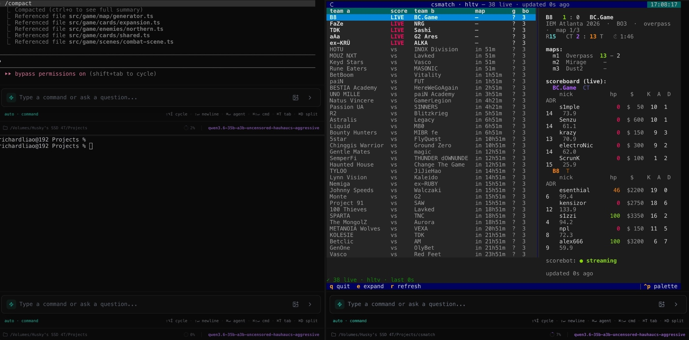
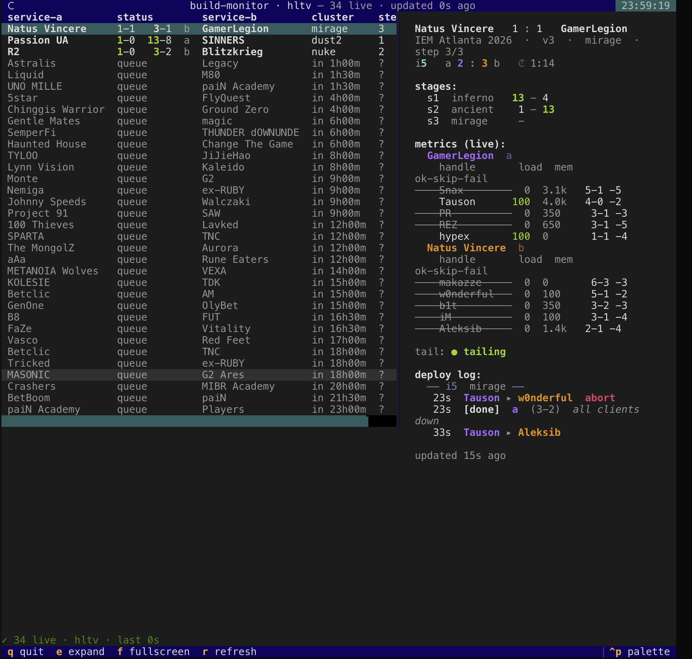

# csmatch

> Live CS2 pro matches in your terminal. No browser, no ads, no API key.



## What it solves

- **Watch matches without a browser.** Series score, current map, round timer, per-player K/A/D/HP/$/ADR — every second, in plain text.
- **Real per-kill feed.** With weapon, headshot, assist, and bomb plant/defuse. The same data HLTV streams to its match center page.
- **What's on next.** Upcoming today, with countdowns.
- **Three display modes** (cycle with `w`): structured CS log, natural-language play-by-play, and a build/SRE-monitor disguise — see below.

## Install

```sh
uv sync
uv run playwright install chromium    # only for HLTV live scorebot
```

## Run

```sh
uv run csmatch                  # default (bo3.gg, broad coverage)
uv run csmatch --source hltv    # full live scorebot
uv run csmatch --once           # one-shot text dump of current live matches
```

> **Heads-up for `--source hltv`:** the very first time you press `e` on a live match, csmatch launches a Chromium window in the background (positioned off-screen, hidden from the Dock, focus immediately bounced back to your terminal). It stays alive for the rest of the session — subsequent expands and match-cursor moves reuse the same browser silently. See [How the live scorebot works](#how-the-live-scorebot-works) below.

## Keys

| key | action |
| --- | --- |
| `↑` `↓` | move focus |
| `e` | expand the focused match |
| `f` | fullscreen the detail pane (`Esc` to exit) |
| `w` | cycle display mode: default → narrative → monitor |
| `PgUp` `PgDn` / `j` `k` | scroll detail |
| `r` | refresh now |
| `q` | quit |

## Themes

Press `w` to cycle three display modes: **default → narrative → monitor**.

The default mode is a refined structured log: rounds group into blocks (newest round on top, events reading chronologically inside), each header carries the result (`KOLESIE win · defused · 3-1`), and kills are annotated with the opening duel (`·opening`), multi-kills (`·3K`/`·ACE`), won clutches (`⤷ rendysky 1v2 clutch`), and an approximate map zone (`A site`, `mid`, `B approach`) derived from the kill's world coordinates.

The narrative mode tells the same rounds as prose — `ex1st opened the round, killing amster with an M4A1-S (headshot) at A approach` … `KOLESIE won the round — bomb defused (3-1).` — while the scoreboard stays structured.

The monitor mode re-labels everything as a build/SRE monitor — same numbers, different vocabulary (kills become arrowed events, zones become `sector A`/`core`, clutches become `solo-recover 1v2`).

<p align="center"></p>

In the monitor mode the score column becomes `status`, maps become `clusters`, rounds become `iters`, kills render as arrowed events, and bomb plant / defuse become `[deploy]` / `[rollback]`. Player names and numbers stay readable. The screenshot above also shows the narrow stacked layout (list above, scrollable detail below) that kicks in automatically when the terminal is under ~100 columns wide.

## How the live scorebot works

HLTV streams real-time per-kill data over a Socket.IO (Engine.IO v3) endpoint behind Cloudflare. csmatch launches a Chromium pointed off-screen at `(-2400, -2400)` and, *from inside the match page*, runs its own Engine.IO long-polling client against `scorebot-lb.hltv.org`. Running in the page context means the requests inherit the page's cookies / TLS / origin and clear Cloudflare like HLTV's own client does — and because it's a separate connection we fully control, we parse the raw `log` + `scoreboard` events directly rather than scraping the rendered DOM.

This matters for accuracy: the visible kill-feed DOM is virtualised to ~15 rows and carries no event ids, so polling it drops bursts and de-dupes identical kills across rounds — the old "lost events" failure. The socket carries every kill with a stable `eventId`, so capture is lossless and realtime. Round transitions are derived from the authoritative scoreboard (so they survive reconnects), and the per-map series header + round clock come from a light read-only DOM read.

On macOS the Chromium process is hidden from the Dock and Cmd-Tab via `osascript`, and focus is bounced back to whichever terminal app was frontmost so the launch doesn't steal your input.

First run downloads Chromium (~200 MB).

## Rate-limit-friendly

HLTV uses Cloudflare and will temp-ban IPs that poll too aggressively. csmatch ships with conservative defaults — 45 s for the match list, 25 s while a match is expanded, 15 s for per-match detail — plus ±30 % jitter so requests don't fire on exact intervals. When the live scorebot bridge is streaming a match, the redundant HTTP detail fetch is skipped entirely (the bridge already has richer data). An upstream `429` or Cloudflare `1015` is detected and the next poll backs off to 90 s automatically.

## Source comparison

| source | match list | series + current map | per-player K/A/D + HP/$ | per-kill / bomb |
|---|---|---|---|---|
| `--source bo3` *(default)* | ✓ live + upcoming | ✓ score + side | — | — |
| `--source hltv` | ✓ live + upcoming | ✓ | ✓ every second | ✓ every kill |

## Adapts to your terminal

- Below ~100 cols: list and detail stack vertically (works in tmux / iTerm split panes).
- Below 64 cols: per-player table drops ADR, money uses compact `$Xk` format.

## Tests

```sh
uv run pytest -q
```

Run against captured fixture payloads — no network needed.

## Layout

```
src/csmatch/
  models.py     pydantic models (Match, Player, Score, …)
  cli.py        click entry
  tui.py        Textual app
  scorebot.py   Playwright bridge → in-page Engine.IO client → live HLTV scorebot
  vocab.py     label sets for the display modes
  analysis.py  live round analysis (opening / multi-kill / clutch)
  narrate.py   natural-language event narration
  locations.py approximate kill zones from world coordinates
  sources/
    base.py     MatchSource ABC
    bo3gg.py    bo3.gg JSON API
    hltv.py     HLTV.org HTML
    mock.py     fixtures for offline dev
```
